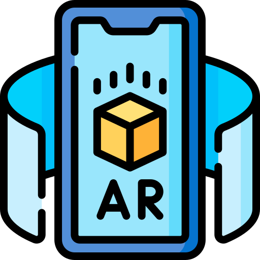
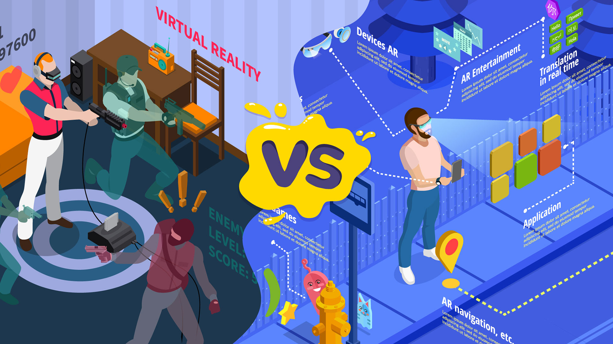

# VR vs AR

---
## Table of contents

1. Introduction
2. Differences
3. Benefits / Drawbacks
4. Current Technologies
5. A glimpse into the future

--

# VR 
## (virtual reality)

---
## 

- Immersive/interactive experience <!-- .element: class="fragment" data-fragment-index="1" -->
  - 1968 - Sword of Damocles <!-- .element: class="fragment" data-fragment-index="2" -->
- Use cases: Gaming, Real Estate... <!-- .element: class="fragment" data-fragment-index="3" -->
- Hardware (Headset, Trackers...)  <!-- .element: class="fragment" data-fragment-index="4" -->
- Apple, Meta, Valve <!-- .element: class="fragment" data-fragment-index="5" -->
--

# AR
## (augmented reality)

---
## 

- Overlays digital information <!-- .element: class="fragment" data-fragment-index="1" -->
    - early 90s - Virtual Fixtures System <!-- .element: class="fragment" data-fragment-index="2" -->
- Use cases: Gaming, Navigation... <!-- .element: class="fragment" data-fragment-index="3" -->
- Hardware (Smartphone, HMD)  <!-- .element: class="fragment" data-fragment-index="4" -->
- Microsoft, Pokemon Go, Google Glass <!-- .element: class="fragment" data-fragment-index="5" -->

--

# Differences
## 

---

## What are the differences?
* VR is completely virtual <!-- .element: class="fragment fade-up" data-fragment-index="1" -->
  * AR users can interact with their physical environment <!-- .element: class="fragment fade-up" data-fragment-index="1" -->
* AR can be accessed with a smartphone <!-- .element: class="fragment fade-up" data-fragment-index="2" -->
  * VR requires a headset device <!-- .element: class="fragment fade-up" data-fragment-index="2" -->
* Majority of VR applications are designed for entertainment <!-- .element: class="fragment fade-up" data-fragment-index="3" -->
  * AR increasingly being used by businesses (Ikea place) <!-- .element: class="fragment fade-up" data-fragment-index="3" -->
--

# Benefits of AR
## 
---

## 

- Improved learning <!-- .element: class="fragment semi-fade-out" data-fragment-index="1" -->
  - Especially children benefit from the experience <!-- .element: class="fragment semi-fade-out" data-fragment-index="1" -->
- Improved teaching <!-- .element: class="fragment semi-fade-out" data-fragment-index="2" -->
  - Helpful information while practicing <!-- .element: class="fragment semi-fade-out" data-fragment-index="2" -->
- Navigation <!-- .element: class="fragment semi-fade-out" data-fragment-index="3" -->
  - Information while being aware of your surroundings <!-- .element: class="fragment semi-fade-out" data-fragment-index="3" -->

---
# Drawbacks of AR
## 
---

## 

- Privacy <!-- .element: class="fragment highlight-red" data-fragment-index="1" -->
  - Data breaches, companies collecting data <!-- .element: class="fragment highlight-red" data-fragment-index="1" -->
- Dependency on devices <!-- .element: class="fragment highlight-blue" data-fragment-index="2" -->
  - Smartphones, tablets, AR glasses <!-- .element: class="fragment highlight-blue" data-fragment-index="2" -->
- Potential distraction <!-- .element: class="fragment highlight-green" data-fragment-index="3" -->
  - Driving, walking... <!-- .element: class="fragment highlight-green" data-fragment-index="3" -->

--
## Benefits of VR
## 
---
# 

- Therapeutic application <!-- .element: class="fragment" data-fragment-index="1" -->
  - phobias, mental health treatments <!-- .element: class="fragment" data-fragment-index="1" -->
- Remote collaboration <!-- .element: class="fragment" data-fragment-index="2" -->
  - vr chat <!-- .element: class="fragment" data-fragment-index="2" -->
- Architectual visualization <!-- .element: class="fragment" data-fragment-index="3" -->
  - planning before actual construction <!-- .element: class="fragment" data-fragment-index="3" -->

---
## Drawbacks of VR
## 
---
- Cost <!-- .element: class="fragment highlight-red" data-fragment-index="1" -->
  - can be very expensive <!-- .element: class="fragment highlight-red" data-fragment-index="1" -->
- Health Concerns <!-- .element: class="fragment highlight-blue" data-fragment-index="2" -->
  - eye strains, headaches <!-- .element: class="fragment highlight-blue" data-fragment-index="2" -->
- Escapism <!-- .element: class="fragment highlight-green" data-fragment-index="3" -->

--

## Current Technologies
---
# 
- Pokemon GO <!-- .element: class="fragment" data-fragment-index="1" -->
- AR Glasses <!-- .element: class="fragment" data-fragment-index="2" -->
- VR Headset - Valve Index <!-- .element: class="fragment" data-fragment-index="3" -->
- VR Headset - Meta Quest 2 <!-- .element: class="fragment" data-fragment-index="4" -->
- VR Headset - Apple Vision Pro <!-- .element: class="fragment" data-fragment-index="5" -->

--

## Future Predictions

--

# Thank you for your attention <3
---
## Sources
- https://virtualspeech.com/blog/history-of-vr
- https://www.smu.edu/Meadows/NewsAndEvents/News/2023/Augmented-Reality-vs-Virtual-Reality
- https://www.apple.com/apple-vision-pro/
---
- https://omnia360.de/blog/was-ist-augmented-reality/
- https://sopa.tulane.edu/blog/whats-difference-between-ar-and-vr
- https://magic-holo.com/unterschied-virtual-reality-vr-und-augmented-reality-ar/
- https://icon-icons.com/icon/augmented-reality-smartphone/111367
- https://www.playstation.com/de-de/ps-vr/
---
- https://stock.adobe.com/de/search?k=benefits
- https://www.shutterstock.com/search/drawbacks
- https://www.flaticon.com/free-icon/augmented-reality_6357965
- https://en.wikipedia.org/wiki/Virtual_fixture
- https://www.cablematters.com/Blog/Virtual-Reality/vr-vs-ar
- https://www.24framesdigital.com/blog/blog.aspx?contentid=ar-vr-difference
- https://pokemongolive.com/?hl=de
---
- Special thanks: https://openai.com/